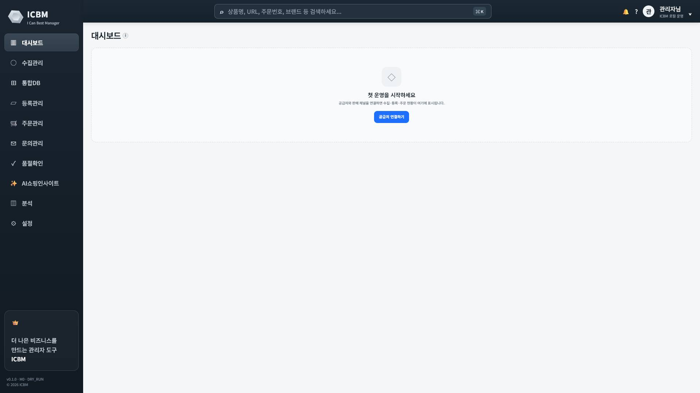
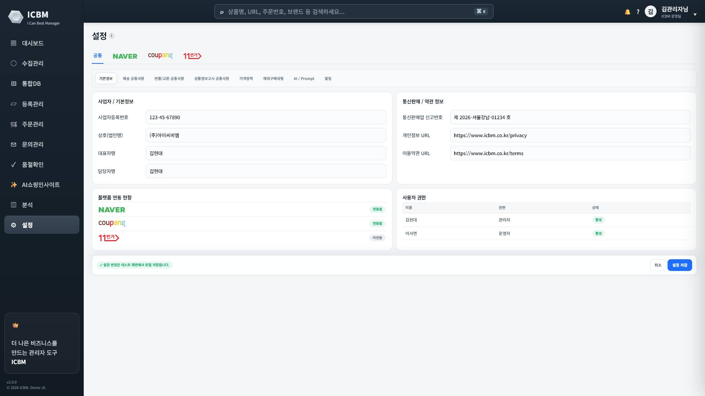
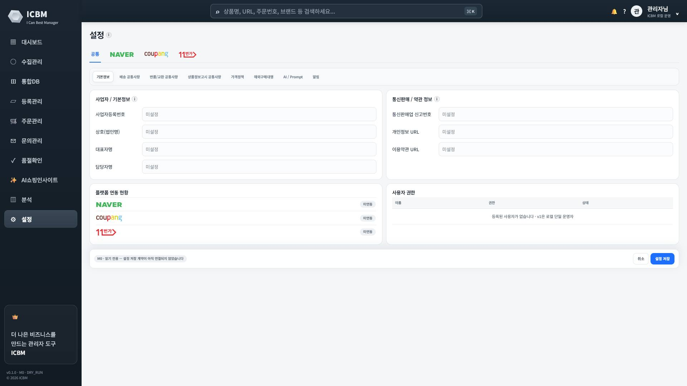
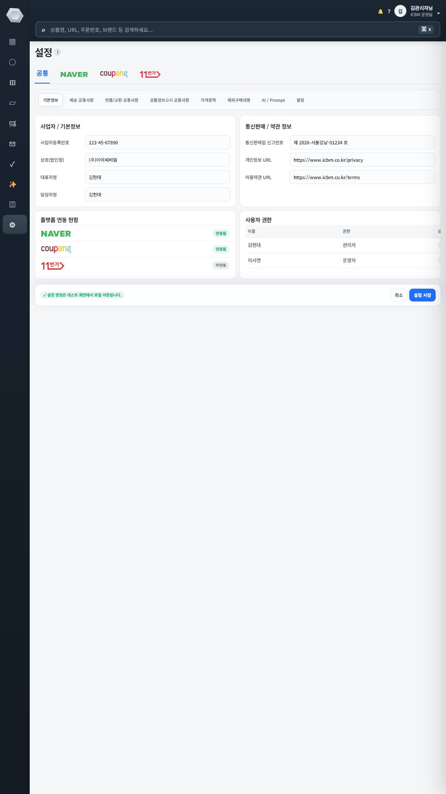
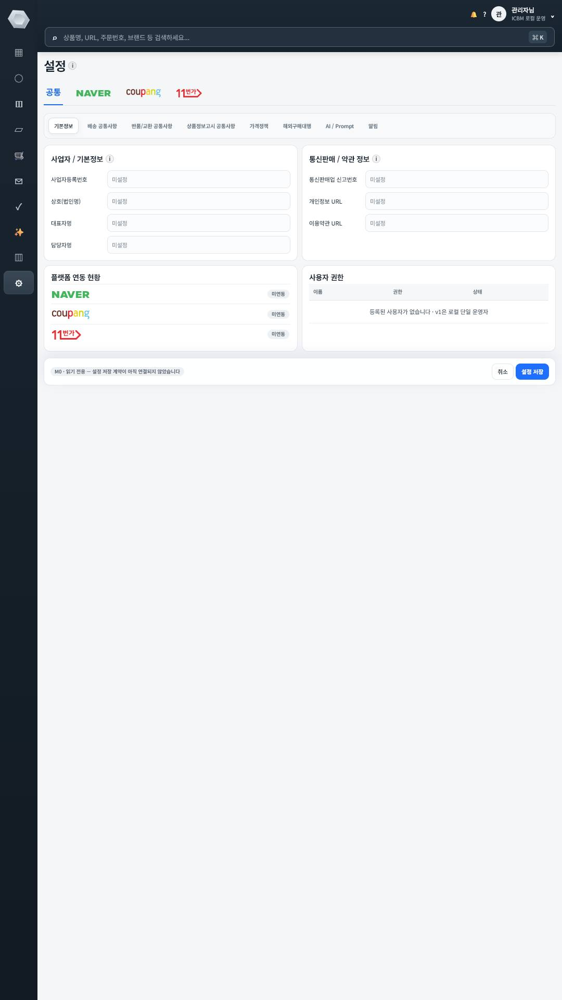
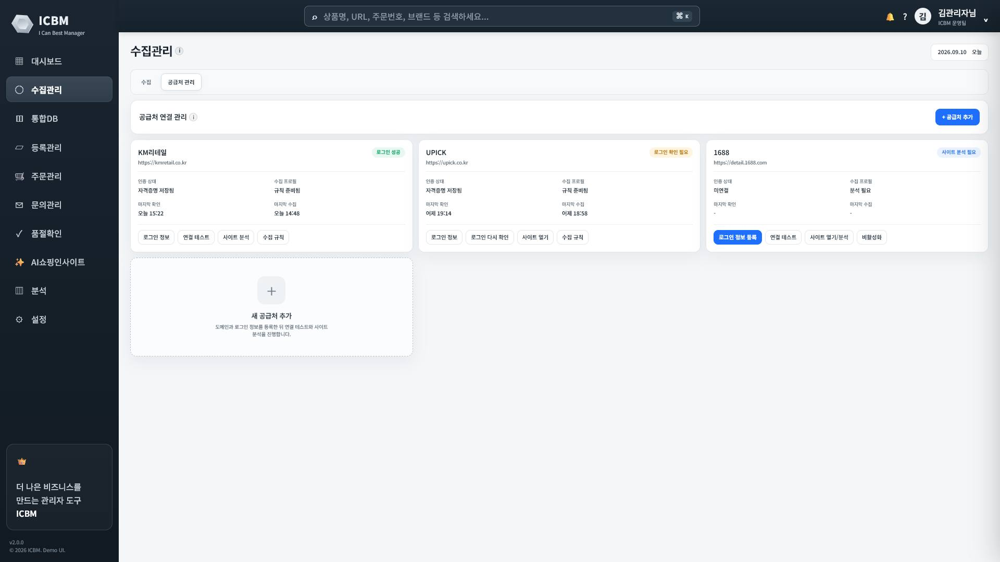
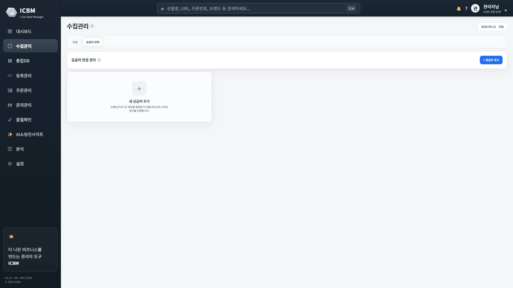

# M0 Acceptance Evidence — Fresh UI Shell + Phase 0 Foundation

Status: **ACCEPTED**
Architect acceptance date: 2026-09-13
Architect PR review: [5190491898](https://github.com/allday8556/ICBM-NEW/pull/2#pullrequestreview-5190491898) — final verdict **M0 PASS**
Merged: PR #2 → `main` as merge commit `ebc9d1da989c8883d7ce0fd2721d301425192d2f`
Author: Claude Code
Issue: [allday8556/ICBM-NEW#1](https://github.com/allday8556/ICBM-NEW/issues/1) · Branch: `feat/infra-m0-foundation` (merged) · Post-M0 canonical sync: [allday8556/ICBM-NEW#3](https://github.com/allday8556/ICBM-NEW/issues/3)

Evidence and PR head:

```text
2c2c6713d62a819ed9dabc57bd269824a92a5cd5 = original raw acceptance evidence run (every number and file in this document)
d2ac1ef7125ff39c6c959eeb9d5569b6d11f8eb2 = PR head after adding this acceptance documentation;
                                           the current head also passed CI including clean-checkout acceptance
```

The two commits differ only by the acceptance-documentation commit; runtime code is identical. CI on `d2ac1ef`: [push run 34753175732](https://github.com/allday8556/ICBM-NEW/actions/runs/34753175732) and [pull_request run 34753193525](https://github.com/allday8556/ICBM-NEW/actions/runs/34753193525), both success including the Windows clean-checkout acceptance. This is documentation clarity, not an acceptance defect.

UI Source of Truth: `ui/prototypes/icbm_redesign_test_v29_final.html` — SHA-256 `896ad87011b8615b8a6a9cd3e790ca04f52e908e4ff7b6a26ea4bf5372dfeb82`, 323,751 bytes (re-verified by `tests/unit/test_repository_rules.py` on every run)

Result of the evidence run: **PASS — 24/24 checks** (2026-09-13T10:54:29.610+00:00 → 2026-09-13T10:55:45.505+00:00).

## 1. How the evidence was produced

1. **Clean checkout** of `feat/infra-m0-foundation` from GitHub into an empty directory (worktree clean: `True`, commit `2c2c6713d62a819ed9dabc57bd269824a92a5cd5`).
2. **Install** into a fresh virtual environment: `python -m pip install -c constraints.txt -e ".[dev]"`.
3. **Tests** in the clean checkout: `pytest` → `99 passed, 2 warnings`.
4. **Acceptance**: `python scripts/m0_acceptance.py --visual`. The script runs the real application as a separate OS process on a free loopback port and a fresh data directory, inspects the SQLite file directly with `sqlite3` (independently of the application), stops the server with Ctrl+Break (uvicorn graceful shutdown) and restarts it twice.

Environment: Windows-11-10.0.26200-SP0, Python 3.13.15, msedge 153.0.4234.32 driven by Playwright with the locally installed browser (nothing downloaded). Python 3.12 is proven by CI (§6 L1).

CI (Python 3.12 — lint/format/type check, tests on Ubuntu and Windows, migration round trip, Windows clean-checkout acceptance with visual check): **SUCCESS** — [34752836721](https://github.com/allday8556/ICBM-NEW/actions/runs/34752836721). The CI acceptance job repeated this whole flow on `windows-latest` with CPython 3.12.10: **PASS (24/24 checks)**; its evidence is kept as the run's `m0-acceptance-evidence` artifact.

Raw evidence in [`docs/acceptance/M0/`](M0/): `evidence.json` (every check with its data), `trace-deadletter.jsonl`, `logs/icbm.jsonl` (all three server runs), `migrate.log`, `visual/visual-report.json` and 44 screenshots.

## 2. Acceptance criteria (Issue #1)

| # | Criterion | Result | Evidence |
| --- | --- | --- | --- |
| 1 | clean checkout → install → Alembic migration → app starts with empty DB | PASS | §1, §3.1 |
| 2 | deterministic health/readiness PASS | PASS | §3.2 |
| 3 | deliberately failing job retries on schedule and reaches dead-letter at the configured cap | PASS | §3.3 |
| 4 | one `correlation_id` traced across log output, Job record and AuditEvent | PASS | §3.4 |
| 5 | protected-action AuditEvent is persisted | PASS | §3.5 |
| 6 | CI is green | SUCCESS | [CI run](https://github.com/allday8556/ICBM-NEW/actions/runs/34752836721) |
| 7 | all ten top-level screens render in empty state from NEW contracts | PASS | §3.6, §4 |
| 8 | representative landscape and portrait visual checks materially match v29; deviations documented | PASS (deviations in §4.3) | §4 |
| 9 | full restart repeats successfully | PASS | §3.7 |
| 10 | zero supplier/marketplace external calls during M0 acceptance | PASS | §3.8 |
| 11 | no runtime dependency on ICBM-PROJECT or #86 functional implementation | PASS | §3.9 |

## 3. Evidence detail

### 3.1 Clean database, migration, start

- `icbm db upgrade` on an empty data directory → revision `0001_m0_foundation`, `journal_mode=wal`.
- Tables: `alembic_version`, `audit_events`, `job_attempts`, `jobs`; triggers: `trg_audit_events_no_delete`, `trg_audit_events_no_update`.
- Row counts after migration: `jobs`=0, `job_attempts`=0, `audit_events`=0 — the canonical DB starts empty.
- The application process (pid 12468) started on it and answered `GET /api/health` → `{"status": "ok", "version": "0.1.0", "milestone": "M0"}`.

### 3.2 Deterministic readiness

`GET /api/ready` was called twice in each of the three server runs; every call returned HTTP 200 with the same check list and statuses (PASS, PASS, PASS). Checks from run 1:

| Check | Status | Detail |
| --- | --- | --- |
| `database` | PASS | SELECT 1 succeeded |
| `sqlite_wal` | PASS | journal_mode=wal |
| `schema` | PASS | at head 0001_m0_foundation |
| `job_worker` | PASS | running; heartbeat 0.0s ago |
| `secret_store` | PASS | keyring.backends.Windows.WinVaultKeyring (OS credential store) |
| `execution_mode` | PASS | DRY_RUN (external writes disabled) |
| `egress_guard` | PASS | BLOCK_EXTERNAL; installed=True; external_attempts=0 |

### 3.3 Retry, backoff and dead-letter

Configuration for the run: `ICBM_JOB_MAX_ATTEMPTS=4`, backoff base 1 s × 2 (cap 30 s), worker poll 0.1 s. Only `TRANSIENT` and `RATE_LIMITED` are retried (ADR-0004); every other class dead-letters on its first failure (unit/integration tests cover `VALIDATION` and `UNKNOWN`).

`POST /api/v1/diagnostics/failing-job` (enabled only with `ICBM_DIAGNOSTICS=1`) enqueued job `c6760460-a0b1-4b2f-9b58-86cdc3b82893` under correlation ID `m0-acc-20260913T105429Z-deadletter`. The in-process worker (ADR-0002 option A) ran it outside the request path:

| Attempt | scheduled_for (UTC) | started_at | finished_at | Outcome | Error | retry_at |
| --- | --- | --- | --- | --- | --- | --- |
| 1 | 2026-09-13 10:54:32.916423 | 2026-09-13 10:54:32.920103 | 2026-09-13 10:54:32.922613 | FAILED | TRANSIENT / M0_DIAGNOSTIC_FORCED_FAILURE | 2026-09-13 10:54:33.922613 |
| 2 | 2026-09-13 10:54:33.922613 | 2026-09-13 10:54:33.928584 | 2026-09-13 10:54:33.930150 | FAILED | TRANSIENT / M0_DIAGNOSTIC_FORCED_FAILURE | 2026-09-13 10:54:35.930150 |
| 3 | 2026-09-13 10:54:35.930150 | 2026-09-13 10:54:35.932359 | 2026-09-13 10:54:35.933701 | FAILED | TRANSIENT / M0_DIAGNOSTIC_FORCED_FAILURE | 2026-09-13 10:54:39.933701 |
| 4 | 2026-09-13 10:54:39.933701 | 2026-09-13 10:54:39.946909 | 2026-09-13 10:54:39.948304 | FAILED | TRANSIENT / M0_DIAGNOSTIC_FORCED_FAILURE | — (dead-letter) |

| Attempt | Planned delay after previous failure | Expected | Start lag |
| --- | --- | --- | --- |
| 2 | 1.0 s | 1.0 s | 0.006 s |
| 3 | 2.0 s | 2.0 s | 0.002 s |
| 4 | 4.0 s | 4.0 s | 0.013 s |

Final Job row: state `DEAD`, `attempt_count=4` of `max_attempts=4`, last error `TRANSIENT/M0_DIAGNOSTIC_FORCED_FAILURE`.
While the job ran, the API answered 36 health probes — max latency 3.5 ms, median 1.4 ms.

### 3.4 One correlation ID across log, Job and AuditEvent

- Correlation ID: `m0-acc-20260913T105429Z-deadletter`
- Log file `logs/icbm.jsonl`: 16 lines carry it — messages: `audit.appended`, `diagnostic.failing_job.executing`, `http.request`, `job.attempt.failed`, `job.attempt.started`, `job.dead_lettered`, `job.enqueued`.
- Job row `correlation_id`: `m0-acc-20260913T105429Z-deadletter`.
- AuditEvents with the same ID:

| seq | event_type | action | outcome | actor | reason_code | target_ref |
| --- | --- | --- | --- | --- | --- | --- |
| 1 | DIAGNOSTIC_REQUEST | ENQUEUE_FAILING_JOB | ALLOWED | operator:local | — | job:c6760460-a0b1-4b2f-9b58-86cdc3b82893 |
| 2 | JOB_DEAD_LETTERED | JOB_DEAD_LETTER | RECORDED | system:job-worker | M0_DIAGNOSTIC_FORCED_FAILURE | job:c6760460-a0b1-4b2f-9b58-86cdc3b82893 |

Log excerpt (`M0/trace-deadletter.jsonl`, fields trimmed):

```json
{"ts": "2026-09-13T10:54:32.917+00:00", "msg": "job.enqueued", "correlation_id": "m0-acc-20260913T105429Z-deadletter", "job_id": "c6760460-a0b1-4b2f-9b58-86cdc3b82893"}
{"ts": "2026-09-13T10:54:32.918+00:00", "msg": "audit.appended", "correlation_id": "m0-acc-20260913T105429Z-deadletter", "event_type": "DIAGNOSTIC_REQUEST", "action": "ENQUEUE_FAILING_JOB", "outcome": "ALLOWED"}
{"ts": "2026-09-13T10:54:32.922+00:00", "msg": "http.request", "correlation_id": "m0-acc-20260913T105429Z-deadletter", "method": "POST", "path": "/api/v1/diagnostics/failing-job", "status": 202}
{"ts": "2026-09-13T10:54:32.922+00:00", "msg": "job.attempt.started", "correlation_id": "m0-acc-20260913T105429Z-deadletter", "job_id": "c6760460-a0b1-4b2f-9b58-86cdc3b82893", "attempt_no": 1}
{"ts": "2026-09-13T10:54:32.922+00:00", "msg": "diagnostic.failing_job.executing", "correlation_id": "m0-acc-20260913T105429Z-deadletter", "job_id": "c6760460-a0b1-4b2f-9b58-86cdc3b82893", "attempt_no": 1}
{"ts": "2026-09-13T10:54:32.925+00:00", "msg": "job.attempt.failed", "correlation_id": "m0-acc-20260913T105429Z-deadletter", "job_id": "c6760460-a0b1-4b2f-9b58-86cdc3b82893", "attempt_no": 1, "state": "RETRY_SCHEDULED", "retry_delay_s": 0.996988, "error_class": "TRANSIENT", "error_code": "M0_DIAGNOSTIC_FORCED_FAILURE"}
{"ts": "2026-09-13T10:54:33.929+00:00", "msg": "job.attempt.started", "correlation_id": "m0-acc-20260913T105429Z-deadletter", "job_id": "c6760460-a0b1-4b2f-9b58-86cdc3b82893", "attempt_no": 2}
{"ts": "2026-09-13T10:54:33.930+00:00", "msg": "diagnostic.failing_job.executing", "correlation_id": "m0-acc-20260913T105429Z-deadletter", "job_id": "c6760460-a0b1-4b2f-9b58-86cdc3b82893", "attempt_no": 2}
{"ts": "2026-09-13T10:54:33.931+00:00", "msg": "job.attempt.failed", "correlation_id": "m0-acc-20260913T105429Z-deadletter", "job_id": "c6760460-a0b1-4b2f-9b58-86cdc3b82893", "attempt_no": 2, "state": "RETRY_SCHEDULED", "retry_delay_s": 1.999, "error_class": "TRANSIENT", "error_code": "M0_DIAGNOSTIC_FORCED_FAILURE"}
{"ts": "2026-09-13T10:54:35.933+00:00", "msg": "job.attempt.started", "correlation_id": "m0-acc-20260913T105429Z-deadletter", "job_id": "c6760460-a0b1-4b2f-9b58-86cdc3b82893", "attempt_no": 3}
{"ts": "2026-09-13T10:54:35.933+00:00", "msg": "diagnostic.failing_job.executing", "correlation_id": "m0-acc-20260913T105429Z-deadletter", "job_id": "c6760460-a0b1-4b2f-9b58-86cdc3b82893", "attempt_no": 3}
{"ts": "2026-09-13T10:54:35.934+00:00", "msg": "job.attempt.failed", "correlation_id": "m0-acc-20260913T105429Z-deadletter", "job_id": "c6760460-a0b1-4b2f-9b58-86cdc3b82893", "attempt_no": 3, "state": "RETRY_SCHEDULED", "retry_delay_s": 3.999246, "error_class": "TRANSIENT", "error_code": "M0_DIAGNOSTIC_FORCED_FAILURE"}
{"ts": "2026-09-13T10:54:39.948+00:00", "msg": "job.attempt.started", "correlation_id": "m0-acc-20260913T105429Z-deadletter", "job_id": "c6760460-a0b1-4b2f-9b58-86cdc3b82893", "attempt_no": 4}
{"ts": "2026-09-13T10:54:39.948+00:00", "msg": "diagnostic.failing_job.executing", "correlation_id": "m0-acc-20260913T105429Z-deadletter", "job_id": "c6760460-a0b1-4b2f-9b58-86cdc3b82893", "attempt_no": 4}
{"ts": "2026-09-13T10:54:39.949+00:00", "msg": "audit.appended", "correlation_id": "m0-acc-20260913T105429Z-deadletter", "event_type": "JOB_DEAD_LETTERED", "action": "JOB_DEAD_LETTER", "outcome": "RECORDED"}
{"ts": "2026-09-13T10:54:39.950+00:00", "msg": "job.dead_lettered", "correlation_id": "m0-acc-20260913T105429Z-deadletter", "job_id": "c6760460-a0b1-4b2f-9b58-86cdc3b82893", "attempt_no": 4, "state": "DEAD", "error_class": "TRANSIENT", "error_code": "M0_DIAGNOSTIC_FORCED_FAILURE"}
```

### 3.5 Protected-action AuditEvent

`POST /api/v1/system/execution-mode {"target_mode": "LIVE"}` is a protected action (CLAUDE.md §7.1). It returned HTTP 403 `POLICY_BLOCKED/M0_LIVE_FORBIDDEN` and the decision was persisted before the response:

| Field | Value |
| --- | --- |
| `seq` | `3` |
| `event_id` | `a7f22e45-f647-484b-8a72-a65f6111625d` |
| `occurred_at` | `2026-09-13 10:54:40.069845` |
| `correlation_id` | `m0-acc-20260913T105429Z-protected` |
| `actor` | `operator:local` |
| `event_type` | `PROTECTED_ACTION` |
| `action` | `EXECUTION_MODE_CHANGE` |
| `outcome` | `DENIED` |
| `reason_code` | `M0_LIVE_FORBIDDEN` |
| `before_json` | `{"mode": "DRY_RUN"}` |
| `after_json` | `{"mode": "DRY_RUN"}` |
| `details_json` | `{"policy": "M0_DRY_RUN_ONLY", "reason": "M0 acceptance: protected-action audit demonstration", "requested_mode": "LIVE"}` |

Append-only is enforced by the database: a direct `UPDATE` was refused with “audit_events is append-only” and a `DELETE` with “audit_events is append-only”; the row was unchanged afterwards. Execution mode after the request: `DRY_RUN`.

### 3.6 Screen contracts

Every top-level screen is served by its own contract (`GET /api/v1/screens/{screen}`) through the UI → contract → service → state path. Run 1 and run 3 (after two restarts) returned:

| Screen | state | empty_reason |
| --- | --- | --- |
| `dashboard` | EMPTY | NO_CONNECTIONS |
| `collect` | EMPTY | NO_COLLECTION_JOBS |
| `db` | EMPTY | NO_PRODUCTS |
| `register` | EMPTY | NO_REGISTRATION_CANDIDATES |
| `orders` | EMPTY | NO_ORDERS |
| `inquiry` | EMPTY | NO_INQUIRIES |
| `soldout` | EMPTY | NO_STOCK_REVIEW_ITEMS |
| `ai-insight` | EMPTY | NO_INTERNAL_HISTORY |
| `analytics` | EMPTY | NO_OPERATING_DATA |
| `settings` | EMPTY | NO_SETTINGS_SAVED |

Run 3 result identical: `True`. The shell contract supplies marketplace identity (smartstore, coupang, st11, gmarket, auction) and execution mode `DRY_RUN`.

### 3.7 Full restart

| Event | Evidence |
| --- | --- |
| run 1 stop | graceful; `app.stopped` log lines = 1 |
| job waiting for retry at stop | `c4b819d5-6d33-40ff-92be-6aa5082d8792` (correlation `m0-acc-20260913T105429Z-restart`) — `state=RETRY_SCHEDULED` `attempt_count=1` `next_attempt_at=2026-09-13 10:55:36.952371` |
| run 2 (restart) | readiness PASS; pending job resumed → `state=DEAD` `attempt_count=4` `finished_at=2026-09-13 10:55:43.394254`; earlier dead-letter unchanged → `state=DEAD` `attempt_count=4` `finished_at=2026-09-13 10:54:39.948304` |
| run 2 stop | graceful; `app.stopped` log lines = 2 |
| run 3 (second restart) | readiness PASS; canonical state before second restart `jobs_by_state=DEAD: 2` `job_attempts=8` `audit_events=5`; after `jobs_by_state=DEAD: 2` `job_attempts=8` `audit_events=5` |
| run 3 stop | graceful; `app.stopped` log lines = 3 |

### 3.8 Zero supplier/marketplace external calls

- No supplier or marketplace adapter exists in M0: `integrations/` declares protocols and marketplace presentation identity only.
- A process-wide egress guard (`app/core/egress.py`) observes the interpreter's own `socket.connect`, `socket.sendto`, `socket.getaddrinfo` and `socket.gethostbyname` audit events (PEP 578) and blocks and counts every non-loopback destination, whatever library makes the call. Readiness fails if the count is non-zero.
- External connection attempts per server run: 0, 0, 0 (runs 1–3); egress readiness check PASS in every run.
- The UI is served with `Content-Security-Policy: default-src 'self'; …` and loads no external resource. The visual check recorded every browser request of the M0 pages: 732 requests, **0 external**, 0 console errors.

### 3.9 No runtime dependency on ICBM-PROJECT / #86

- Installed distributions in the clean environment (42) contain no ICBM-PROJECT package (`evidence.json → environment.installed_distributions`).
- `tests/unit/test_repository_rules.py` fails if runtime code (`app/`, `integrations/`, `ui/web/`) references the legacy project.
- No legacy code, schema, test, handler or #86 functionality was inspected or copied; the UI was rebuilt from the approved v29 prototype only.

## 4. UI reproduction (ADR-0003)

### 4.1 What was reproduced

- **Shell**: sidebar (brand mark, ten navigation items in v29 order and icons, side card, footer), dark topbar with command search, operator badge; responsive bands identical to v29 (228 px rail; 82 px compact rail at ≤1280 px or any portrait; 72 px portrait ≥901 px; 60 px ≤620 px; wrapped topbar; column page heads).
- **Screens**: page heads with one help icon each; the approved v28/v29 runtime-ready zero-data surface with v29 copy and call to action on all data screens; the supplier-management zero state (“새 공급처 추가”) and credential modal shape; the full settings structure — four scope tabs with marketplace marks, 8 + 5 + 6 + 4 sub-tabs, setting cards, toggles, policy flows, prompt registry and save bar.
- **Token layer** `ui/web/css/tokens.css`: colours, typography (13 sizes, 5 weights), spacing, radii and elevation consolidated from v29's effective values.
- **One owner per concern** (replacing v29's patch generations): help tooltip `core/help.js` (v18/v22/v27 → one), modal `core/modal.js` (focus trap, Escape, focus restore), marketplace identity `core/platform.js` fed by the shell contract (`integrations/marketplaces/identity.py`), inert M0 controls `core/inert.js`, routing `core/router.js`.
- **Accessibility kept from v29**: WCAG-oriented text tokens, global `:focus-visible` ring, `prefers-reduced-motion`, labelled controls, `aria-current` navigation, `role=switch` toggles.

### 4.2 Measured comparison (Edge, same fonts, v29 in its own zero-data mode `ICBMUIEmpty`)

Sidebar width, topbar height, title font (23 px/760 landscape, 24 px/760 portrait) and navigation count matched on every screen. Boxes are (x, y) width×height in CSS px:

**Landscape 1920×1080**

| View | v29 title | M0 title | v29 empty state | M0 empty state | Help icons | External requests | Verdict |
| --- | --- | --- | --- | --- | --- | --- | --- |
| `dashboard` | (250, 84) 102×27 | (250, 84) 102×27 | (250, 131) 1648×260 | (250, 131) 1648×260 | 1 | 0 | match |
| `collect` | (250, 84) 102×27 | (250, 84) 102×27 | (250, 133) 1648×260 | (250, 192) 1648×260 | 1 | 0 | differs: empty_state_box (§4.3 D1) |
| `db` | (250, 84) 92×27 | (250, 84) 92×27 | (250, 133) 1648×260 | (250, 133) 1648×260 | 1 | 0 | match |
| `register` | (250, 84) 102×27 | (250, 84) 102×27 | (250, 131) 1648×260 | (250, 131) 1648×260 | 1 | 0 | match |
| `orders` | (250, 84) 102×27 | (250, 84) 102×27 | (250, 131) 1648×260 | (250, 131) 1648×260 | 1 | 0 | match |
| `inquiry` | (250, 84) 102×27 | (250, 84) 102×27 | (250, 131) 1648×260 | (250, 131) 1648×260 | 1 | 0 | match |
| `soldout` | (250, 84) 102×27 | (250, 84) 102×27 | (250, 131) 1648×260 | (250, 131) 1648×260 | 1 | 0 | match |
| `ai-insight` | (250, 84) 175×27 | (250, 84) 175×27 | (250, 133) 1648×260 | (250, 133) 1648×260 | 1 | 0 | match |
| `analytics` | (250, 84) 62×27 | (250, 84) 62×27 | (250, 133) 1648×260 | (250, 133) 1648×260 | 1 | 0 | match |
| `settings` | (250, 84) 62×27 | (250, 84) 62×27 | — | — | 1 | 0 | match |
| `collect-suppliers` | (250, 84) 102×27 | (250, 84) 102×27 | — | — | 1 | 0 | match |

**Portrait 1080×1920**

| View | v29 title | M0 title | v29 empty state | M0 empty state | Help icons | External requests | Verdict |
| --- | --- | --- | --- | --- | --- | --- | --- |
| `dashboard` | (84, 112) 106×28 | (84, 112) 106×28 | (84, 154) 984×260 | (84, 154) 984×260 | 1 | 0 | match |
| `collect` | (84, 112) 106×28 | (84, 112) 106×28 | (84, 205) 984×260 | (84, 264) 984×260 | 1 | 0 | differs: empty_state_box (§4.3 D1) |
| `db` | (84, 112) 95×28 | (84, 112) 95×28 | (84, 205) 984×260 | (84, 205) 984×260 | 1 | 0 | match |
| `register` | (84, 112) 106×28 | (84, 112) 106×28 | (84, 154) 984×260 | (84, 154) 984×260 | 1 | 0 | match |
| `orders` | (84, 112) 106×28 | (84, 112) 106×28 | (84, 154) 984×260 | (84, 154) 984×260 | 1 | 0 | match |
| `inquiry` | (84, 112) 106×28 | (84, 112) 106×28 | (84, 154) 984×260 | (84, 154) 984×260 | 1 | 0 | match |
| `soldout` | (84, 112) 106×28 | (84, 112) 106×28 | (84, 154) 984×260 | (84, 154) 984×260 | 1 | 0 | match |
| `ai-insight` | (84, 112) 182×28 | (84, 112) 182×28 | (84, 205) 984×260 | (84, 205) 984×260 | 1 | 0 | match |
| `analytics` | (84, 112) 63×28 | (84, 112) 63×28 | (84, 205) 984×260 | (84, 205) 984×260 | 1 | 0 | match |
| `settings` | (84, 112) 63×28 | (84, 112) 63×28 | — | — | 1 | 0 | match |
| `collect-suppliers` | (84, 112) 106×28 | (84, 112) 106×28 | — | — | 1 | 0 | match |

Representative screenshots (all 44 are in `M0/visual/`):

| View | v29 (approved) | M0 |
| --- | --- | --- |
| Dashboard · 1920×1080 |  |  |
| Settings · 1920×1080 |  |  |
| Settings · 1080×1920 |  |  |
| 수집관리 · 공급처 관리 · 1920×1080 |  |  |

### 4.3 Documented deviations

| ID | Deviation | Reason |
| --- | --- | --- |
| D1 | 수집관리 keeps its 수집 / 공급처 관리 tabs visible in the empty state, so the empty card sits one tab-row lower (landscape +59 px, portrait +59 px). | v29's empty mode hides the tabs, which leaves the dashboard CTA “공급처 연결하기” with no reachable supplier view. |
| D2 | 수집 empty-state CTA “첫 상품 수집하기” opens 공급처 관리 (v29: stays on 수집). | Collection needs a connected supplier first. |
| D3 | 주문관리/문의관리 CTA “스마트스토어 연결하기” opens Settings on the SmartStore tab (v29: Settings › 공통). | Lands on the relevant connection surface. |
| D4 | Settings fields show “미설정” read-only; toggles render OFF and inert (v29: demo company data, toggles ON from `localStorage`). | No demo business data may become runtime truth; no settings persistence contract exists in M0 (`editable=false`). |
| D5 | Connection and permission chips show 미연동 / 미연결 / 연동 전 from the contract (v29 demo: 연동됨 / 사용 예정). | Server-owned connection state. |
| D6 | Prompt-registry cards show “M0 · 미연결” (v29 “v1 · 사용중”); the prompt-editor modal and its prompt texts are not reproduced. | AI prompt management is Phase 7; prototype prompts are demo content, not runtime truth. |
| D7 | 사용자 권한 table shows one empty row and fits the card in portrait (v29 lists demo users and overflows at 760 px). | v1 is a single local operator; the v29 overflow is a defect. |
| D8 | Operator badge “관리자님 · ICBM 로컬 운영” and footer “v0.1.0 · M0 · DRY_RUN” come from the shell contract (v29 demo: 김관리자님 · ICBM 운영팀, “Demo UI.”). | No demo identity; execution mode is always visible. |
| D9 | Controls without a contract keep their v29 look but announce “M0 표시 전용” in a toast instead of acting (v29 prototype toasts/`localStorage`). | Zero external writes; nothing is bound before its milestone. |
| D10 | v29's grey shadow on the right viewport edge is not reproduced. | It is the off-screen failure drawer's `box-shadow` bleeding into view — a prototype defect. |
| D11 | Populated-state surfaces (KPI rows, lists, detail panels, product editor, preflight, read-back modal, failure drawer, activity modal, registration automation toggles) are not rendered. | Every M0 contract is EMPTY; each surface is built with the milestone whose contract first returns rows, reusing the token layer and component owners. See Q1. |
| D12 | 가격 올림 기준 renders as a read-only field instead of a `<select>`. | No values exist to choose from in M0. |

## 5. Deliverables (Issue #1)

| # | Deliverable | Where |
| --- | --- | --- |
| 1 | Fresh application/runtime skeleton | `app/` (config, core, db, jobs, audit, system, stage packages, screens, api, container, main, cli), `integrations/` |
| 2 | Alembic bootstrap and empty canonical DB | `app/db/migrations/versions/0001_m0_foundation.py`, `icbm db upgrade` |
| 3 | SQLite WAL configuration | `app/db/database.py` (WAL, busy timeout, foreign keys, process-scoped write coordinator) |
| 4 | Structured logging with `correlation_id` | `app/core/logging.py`, `app/core/correlation.py`, `app/api/middleware.py` |
| 5 | Health/readiness endpoint | `GET /api/health`, `GET /api/ready` (`app/system/readiness.py`) |
| 6 | Error taxonomy foundation | `app/core/errors.py`, `app/api/errors.py` (canonical envelope) |
| 7 | Durable `Job` model + scheduler/worker boundary | `app/jobs/` (JobService → Job row → JobRunner → JobWorker) |
| 8 | Retry/backoff + dead-letter with a failing M0 job | `app/jobs/policy.py`, `app/jobs/runner.py`, `app/jobs/diagnostic.py`; §3.3 |
| 9 | Append-only `AuditEvent` + protected-action demonstration | `app/audit/`, `app/system/execution_mode.py`, DB triggers; §3.5 |
| 10 | UI shell reproduced from v29 | `ui/web/`; §4 |
| 11 | Ten screens through NEW contracts, empty state | `app/screens/`, `app/api/routes/screens.py`, `ui/web/js/pages/`; §3.6 |
| 12 | No demo business data as runtime truth | contracts carry only canonical state; §4.3 D4–D8 |
| 13 | Registration automation controls visual-only, zero external writes | not rendered while REGISTER is EMPTY; no binding exists (§4.3 D11, Q1) |
| 14 | CI: lint/format, type check, tests, migration check | `.github/workflows/ci.yml` (+ Windows clean-checkout acceptance) |
| 15 | `docs/acceptance/M0.md` | this document |

Schema added (M0 only): `jobs`, `job_attempts`, `audit_events` (+ append-only triggers). No commerce entity tables — those follow architect schema review (ARCHITECT_REVIEW §8).

## 6. Known limitations

- **L1** — The local evidence machine only has Python 3.13.15; Python 3.12 (ADR-0001) is proven by CI, where every job pins 3.12 (CPython 3.12.10), including the Windows clean-checkout acceptance (24/24 PASS). Installing 3.12 locally was not done without the user's approval.
- **L2** — The secret-store boundary exists (keyring / Windows Credential Manager) but no credential is read or written in M0; readiness checks backend viability without writing.
- **L3** — Exactly one worker exists per process and claims are atomic, but nothing yet prevents two application processes from sharing one data directory.
- **L4** — Interrupted `RUNNING` jobs are recovered at startup only; the readiness heartbeat would report a single attempt running longer than 60 s as stale. Revisit when long collection jobs arrive (M3).
- **L5** — Settings have no persistence contract; the settings screen is read-only.
- **L6** — Log rotation is 10 MB × 5; evidence-retention policy (C3) and the backup/restore drill (ADR-0001) are outside M0 and required before the first LIVE write.
- **L7** — On the evidence machine a legacy client polls `127.0.0.1:8765`; the new default port is **8790** so it cannot reach ICBM-NEW by accident (the new app rejects those paths anyway).
- **L8** — At submission, canonical documents still named older prototypes: `CLAUDE.md` §11 (v28), `ROADMAP.md` §1.3 (v27), `ui/prototypes/README.md` (v28). Implementation followed `docs/UI_SOURCE_OF_TRUTH.md` and Issue #1 (v29). Resolved by the post-M0 canonical sync (Issue #3, ruling Q4).

## 7. Architect rulings (PR #2 review `5190491898`, Issue #3)

- **Q1** — Registration automation toggles may remain hidden while REGISTER is EMPTY in M0; the actual controls arrive with the contract/milestone that owns them and follow ADR-0004.
- **Q2** — Keep both `JOB_DEAD_LETTERED` and `DIAGNOSTIC_REQUEST` in AuditEvent.
- **Q3** — The Job states `QUEUED | RUNNING | RETRY_SCHEDULED | SUCCEEDED | DEAD` and the `job_attempts` history table are accepted and promoted to [ADR-0005](../adr/0005-durable-job-state-and-attempt-history.md).
- **Q4** — The stale v27/v28 active references listed in L8 are corrected by the post-M0 canonical sync (Issue #3).

## 8. Reproduce

```powershell
git clone https://github.com/allday8556/ICBM-NEW.git
cd ICBM-NEW
git checkout 2c2c6713d62a819ed9dabc57bd269824a92a5cd5   # the evidence run; main contains M0 as well
py -3.12 -m venv .venv
.\.venv\Scripts\python -m pip install -c constraints.txt -e ".[dev]"
.\.venv\Scripts\pytest
.\.venv\Scripts\python scripts\m0_acceptance.py --visual --out var\acceptance\run
```
